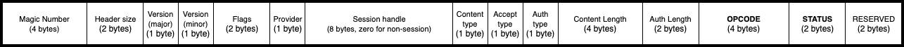
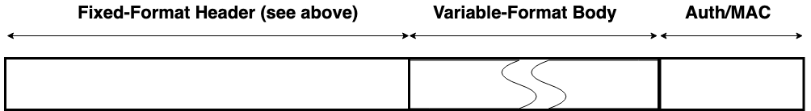

# Wire Protocol

## Introduction

This document describes and specifies the wire protocol that exists between the service and its
clients. It explains the general principles of how the protocol is structured, and goes on to
provide a full specification that can be used as the basis of both client-side and service-side
code.

## Scope

This document describes the principles, patterns and low-level details of the wire protocol. This
covers the details that are common to all messages that pass between the service and its clients.
This document is *not* an API specification for the service. Individual API operations, along with
their behaviours, inputs and outputs are described separately in the API specification. The wire
protocol is the underlying message-passing mechanism that enables the API.

## Audience

A thorough understanding of the wire protocol is necessary if you are developing new capabilities
within certain parts of the service, or if you are developing or extending one of its client
libraries. However, it is not necessary to understand the wire protocol in order to consume the
client API into an application.

## General Principles

### Binary Protocol

The wire protocol is a [**binary**](https://en.wikipedia.org/wiki/Binary_protocol) and
**stream-oriented** protocol. It is designed for speed and compactness of transmission.

### Requests and Responses

The wire protocol is principally structured around the notion of a **request** and a **response**.
Requests and responses are self-contained pairs of entities, where each request is answered by
exactly one response. Requests always travel from the client to the service, and responses always
travel back from the service to the client. Each pair of request and response encapsulates a single
call to a single operation provided by the service. Client library code is concerned with forming
requests and transmitting them to the service. Service code is concerned with processing requests,
forming responses, and transmitting those responses back to the client. The term **message** is used
to refer generically to requests and responses in contexts where there is no need to draw a
distinction between them.

### Analogy With HTTP and REST

The request-response pattern of the wire protocol is intentionally modelled on the familiar notion
of calling a REST API over HTTP. In fact, one of the guiding principles of the wire protocol design
has been to create something that might loosely be called a "lightweight REST". This term must be
applied with caution, however. REST is a collection of architectural principles, not a protocol. It
does not follow that all of the RESTful principles are adopted here. However, thinking of the wire
protocol as being like a web service protocol, only without any dependency on HTTP or similar
stacks, can be a good way to gain an initial understanding. Some patterns of the wire protocol
design have their foundation in a mixture of concepts taken from HTTP and REST, but the wire
protocol itself is neither of these things: it is an entirely bespoke protocol.

### Synchronous Operation

The wire protocol is based on requests and responses, and therefore models synchronous patterns of
interaction. There is nothing in current versions of the protocol to assist with asynchronous
patterns of interaction between the client and the service. Future versions of the protocol may
introduce such concepts. In the meantime, depending on the type of transport used, it may be
possible for the service or the clients to take advantage of asynchronous features of the transport
(such as the non-blocking mode of a socket) to provide certain levels of asynchronous control.

### Separation of Protocol and Transport

The wire protocol defines the format of messages, and some key characteristics and invariants
concerning their transmission between the service and its clients. It does not mandate a specific
transport stack. The wire protocol is a binary, stream-oriented protocol. As such, it can be carried
by any transport medium that supports the reliable transmission of binary octet streams, such as
Unix domain sockets (connected in streaming mode) or TCP sockets. Datagram-oriented transports are
**not** supported, because the protocol depends on the reliable transmission of entire messages in
the proper sequence.

### Separation of Header and Body

Every message (whether request or response) has a **header** and a **body**. Again, this is
conceptually similar to the separation of header and body in HTTP. And, like HTTP, this protocol
allows some flexibility in how the body content is encoded. The wire protocol borrows HTTP's notion
of the **content-type** and **accept** header fields, which allow the client to tell the server how
to interpret the content, and also to declare what kind of response is acceptable in return. The
only difference is that the wire protocol uses numerical byte fields to indicate these values, where
HTTP uses string key-value pairs and media types. This is another illustration of how the wire
protocol can be viewed as a more compact and stripped-down HTTP.

The message headers are **fixed-length** and **fixed-format**. The headers themselves have no
variability in their encoding, nor do they adhere to any encoding or serialization standard. The
format of the header is defined solely by this specification. When writing code to either transmit
or receive a header, the code must be written and validated according to this specification alone.
Headers are composed of a series of single-byte and multi-byte fields.

The header format is specified to be identical for requests and responses. Request and response
headers are of identical size, and have identical fields specified at identical offsets. This means
that developers only need to understand and code to a single header format. This design also means
that shared memory transport technologies can be used where the header resides in a single shared
buffer. However, this design does also means that some fields are redundant depending on the
context. A full specification of the byte fields for the header will be found later in this
document, including information about how and when they should be populated or interpreted.

Headers carry a fixed set of metadata fields that are common to all messages. However, they do not
carry any inputs to or outputs from specific API operations. API inputs and outputs are always
carried in the body. Unlike the header, which is always fixed-length and fixed-format, the body can
be both variable-length and variable-format.

### Protobuf Body

As described above, the wire protocol design allows for the message body to be structured and
encoded in a variety of formats. However, in current manifestations of the protocol, only a single
encoding is defined for use in the message bodies, and this encoding is based on [**protocol
buffers**](https://developers.google.com/protocol-buffers/), also known as **protobuf**.

For each operation in the API, two separate protobuf message definitions will exist: one for that
operation's inputs, and another for its outputs. The body in a request message can be converted
through protobuf-generated code into a model object for the inputs. Likewise, the body in a response
message can be converted through protobuf-generated code into a model object for the outputs.

Processing any message is, therefore, a two-phase process: firstly, the header must be processed by
writing code that is conformant with this specification; and secondly, the content must be processed
according to its content type, which is currently always protobuf.

Future manifestations of the wire protocol might support encoding schemes other than protobuf, in
which case the second phase of processing would differ. This is the reason why the protocol design
has granted some flexibility in terms of the message body encoding.

It is worth re-iterating that protobuf encodings are employed only for *message bodies* and not for
headers. As explained above, headers employ a bespoke binary encoding that is fully defined within
this specification alone. There is no use of protobuf within the header. Headers can be parsed and
generated only by writing code that conforms to this specification document. Again, this permits for
the possibility that a future manifesation might support different encoding schemes.

### Authentication

As described above, all messages in this protocol have a header and a body. If a message is a
request (as opposed to a response), then it will additionally carry a third component: its
**authentication** field.

The wire protocol is agnostic about how the authentication field is interpreted. The request header
measures the size of the field so that the service can consume the correct number of bytes from the
input stream. The request header also includes a one-byte integer label to inform the service how to
interpret the authentication bytes.

Authentication is based on the invariant that all client applications have access to a persistent
unique identifier. This is a string token that allows the assets and actions of one client to be
cleanly separated from those of another. But while this identifier string is the core component of
authentication, there are different ways that it can be used, and consequently there are different
ways for the authentication field to be populated. One simple method is for the client identifier to
be passed directly. But it is also possible to use the identifier as input to an HMAC algorithm over
the body, in which case the authentication field would contain the computed HMAC, rather than the
identifier itself.

### Sessions

The wire protocol supports the notion of sessions, which can be used to allow the client and the
service to track state across multiple API calls. The protocol allocates space within the request
header and the response header for an 8-byte session identifier. Details of how to create and manage
sessions are given in the API specification.

### Wire Protocol Versions

The wire protocol is versioned. It caters for situations where the service and its clients may be
operating at different versions. All messages (requests and responses) carry a major and minor
version number field. Although the design supports having different wire protocol versions, changes
are not expected to happen regularly, and they may not happen at all.

Clients can use the [Ping](operations/ping.md) operation to determine what is the highest version of
the protocol that the service support and switch to that one if they want to. Requests made with a
wire protocol version not supported by the service will be sent back a
`WireProtocolVersionNotSupported` status code response.

Responses will be sent using the same wire protocol version than the requests they originate from.

Please note that the wire protocol version is **not** the mean of finding out the level of support
for specific operations in the API. The [ListOpcodes](operations/list_opcodes.md) operation should
be used, per provider basis, to determine if an operation is supported by the provider.

### Opcodes

All requests contain an unsigned 4-byte integer field called the **opcode**. The opcode is the value
that determines which API operation is being invoked by the requests. Recall that each
request/response pair corresponds to the invocation of exactly one API operation, and each of these
operations is assigned an integer opcode.

The opcode zero is not used and is not valid. The lowest valid opcode is `0x0001`, and the highest
valid opcode is `0xFFFF`.

All [opcodes](operations#overview) are defined within the API specification.

### Status

All responses contain an unsigned 2-byte integer field called the **status**, which is defined to
indicate the overall success or failure of the operation.

The status value of zero (`0x0000`) is used universally to mean that the operation completed
successfully.

With the exception of zero as a special case, other status values are partitioned according to the
same strategy as the opcodes. Status values from 1-999 are reserved for internal service
housekeeping operations, and status values from 1000-1999 are reserved for status codes
corresponding to the Platform Security Architecture (PSA) Cryptography API.

All status values and their definition can be found on the [**Status Codes**](status_codes.md) page.

## Message Structure Specifications

### General Rules

This section provides a complete specification for the interpretation of messages. Based on this
specification, service and client code can be created to both consume and produce conformant
messages on any suitable transport medium.

All multi-byte numerical fields are transported in **little-endian** format: the least significant
byte is sent first.

### The Fixed Common Header

Requests and responses share a common fixed-format header whose specification is given below.
Because the header format is the same for requests and responses, it means that some of the data
fields in the header are unused/ignored depending on whether the header is an outgoing request
(being transmitted from the client to the service), or an incoming response (being returned from the
service back to the client). However, most fields are relevant and common to both.

Each field is annotated according to the following scheme:

- "Common" indicates that the field is common to both request messages and response messages.
- "Requests only" indicates that the field is only used in requests and may be ignored in responses.
- "Responses only" indicates that the field is only used in responses and may be ignored in
   requests.

Fields occur in contiguous memory and there must be no additional padding between them. On the
following diagram, the bytes go left to right from least significant to most significant.

| Name                 | Scheme         | Size (in bytes) | Description                                                                                                                                                                                                                                                                                                                                                                                                                                         |
|----------------------|----------------|-----------------|-----------------------------------------------------------------------------------------------------------------------------------------------------------------------------------------------------------------------------------------------------------------------------------------------------------------------------------------------------------------------------------------------------------------------------------------------------|
| Magic number         | Common         | 4               | Must be `0x5EC0A710` (selected to be an approximate transcoding of SECurity API). This field can be used as an initial validity check for incoming messages. This field **must** be populated in all messages. This field will remain the same across different wire protocol versions.                                                                                                                                                             |
| Header size          | Common         | 2               | Size of the **remainder** of the header in bytes (once the magic number and header size fields have been consumed). Consumers **must** use this field to consume the correct number of bytes of header from the input stream, rather than use this specification to deduce the header size. This field's position and width will remain the same across different wire protocol versions. Only the value of this field may change between versions. |
| Major version number | Common         | 1               | Versioning field. Currently the only supported and valid value for this field is `0x01`. This field's position and width will remain the same across different wire protocol versions. Only the value of this field may change between versions.                                                                                                                                                                                                    |
| Minor version number | Common         | 1               | Versioning sub-field. Currently the only supported and valid value for this field is `0x00`. This field's position and width will remain the same across different wire protocol versions. Only the value of this field may change between versions.                                                                                                                                                                                                |
| Flags                | Common         | 2               | Currently unused and should be set to `0x0000`.                                                                                                                                                                                                                                                                                                                                                                                                     |
| Provider             | Common         | 1               | Identify the back-end service provider for which the request is intended. A value of zero indicates that the request is intended for a special provider, which always exists, and is used for service discovery and communication bootstrapping.                                                                                                                                                                                                    |
| Session handle       | Common         | 8               | Session identifier.                                                                                                                                                                                                                                                                                                                                                                                                                                 |
| Content type         | Common         | 1               | Defines how the message body should be processed. The only currently-supported value is `0x01`, which indicates that the message body should be treated as a serialized protobuf message.                                                                                                                                                                                                                                                           |
| Accept type          | Requests only  | 1               | Defines how the service should provide its response. The only currently-supported value is `0x01`, which indicates that the service should provide a response whose body is a serialized protobuf message.                                                                                                                                                                                                                                          |
| Auth type            | Requests only  | 1               | Defines how the authentication bytes should be interpreted.                                                                                                                                                                                                                                                                                                                                                                                         |
| Content length       | Common         | 4               | Provides the exact number of bytes of body.                                                                                                                                                                                                                                                                                                                                                                                                         |
| Auth length          | Requests only  | 2               | Provides the exact number of bytes of authentication.                                                                                                                                                                                                                                                                                                                                                                                               |
| Opcode               | Common         | 4               | Indicates the operation being performed by this request. See the [section](#opcodes) above on opcodes.                                                                                                                                                                                                                                                                                                                                              |
| Status               | Responses only | 2               | Indicates the overall success or failure of the operation. A value of zero is used universally to mean success. Other values should be interpreted according to the [API specification](status_codes.md).                                                                                                                                                                                                                                           |
| Reserved             | Common         | 2               | Currently unused and must be set to zero.                                                                                                                                                                                                                                                                                                                                                                                                           |

### Requests

A request message begins with the fixed-format header as specified above, followed contiguously by a
variable-length field of zero or more **message body** bytes, which is in turn followed contiguously
in memory by a variable-length field of zero or more **authentication** bytes.

The interpretation of the body and authentication bytes is specified by the relevant fields in the
fixed-format header.

The request body bytes **must** immediately follow the request header bytes, and the size of the
body must precisely match the Content Length field of the header with no additional padding or
alignment.

The authentication bytes **must** immediately follow the request body bytes, and the size of the
authentication field must precisely match the Auth Length field of the header with no additional
padding or alignment.

### Responses

A response message begins with the fixed-format header as specified above, followed contiguously by
a variable-length field of zero or more **message body** bytes.

The interpretation of the body is specified by the relevant fields in the fixed-format header.

The response body bytes **must** immediately follow the response header bytes, and the size of the
body must precisely match the Content Length field of the header with no additional padding or
alignment.

*Copyright 2019 Contributors to the Parsec project.*
