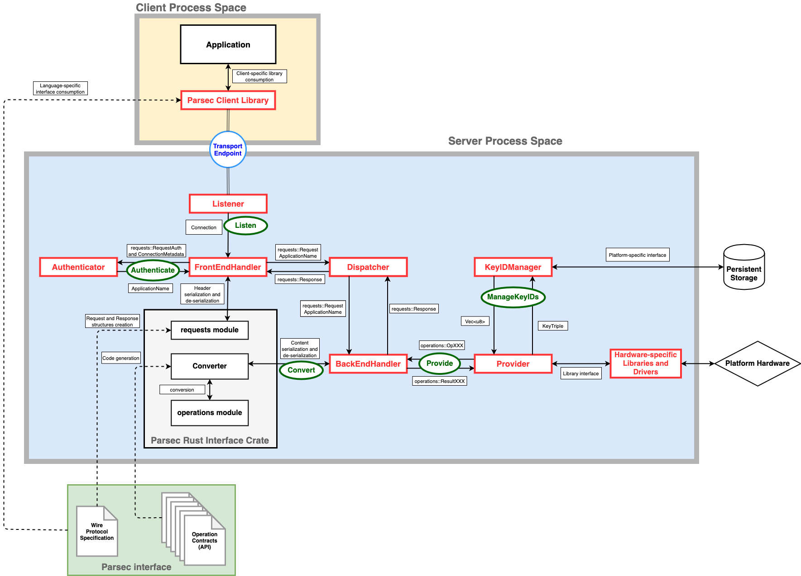

# Interfaces and Dataflow

## Introduction

This document describes the key interfaces and data flows within the service. It can be used in
combination with the [**source code structure**](source_code_structure.md) and [**wire
protocol**](../parsec_client/wire_protocol.md) documents to gain an understanding of how API
requests are received by the service and ultimately fulfilled by providers.

## Status Note

This is preliminary documentation. It may be incomplete, and is subject to change without notice.

## Data Flow Diagram

The sections within this documentation are best understood with reference to the following data flow
diagram. The shaded areas below can also be used to cross-reference the data flow with the [**source
code structure**](source_code_structure.md) document, which can help with finding the relevant
definitions and implementations.

## The Data Flow Backbone

The **data flow backbone** refers to the overall flow of a single API request from a client
application, via the client library, through the IPC transport, through the service to a provider,
and then back again. It is captured by the bold red boxes in the flow diagram above. This
fundamental flow is common to all requests, no matter how they are fulfilled. Once a request hits a
back-end provider, it can be processed in an arbitrary number of different ways, using a combination
of hardware and software facilities provided by the target platform. However, the same fundamental
flow is always used to carry the request through the core parts of the service between the provider
and the client application.

There are at least two distinct processes involved in any API interaction: the client application
and the service. The architecture also supports out-of-process co-services that can be spawned as
child processes by the main service, making it possible for a full deployment to involve three or
even more distinct processes. Whenever data is transferred between processes, whether between the
client and the service, or between the service and a co-service, the same wire protocol
specification is always used to transfer the data as a serialized stream of bytes.

Out-of-process providers are supported in the architecture, but are not yet supported in the
implementation. The rationale for out-of-process providers is that it allows for them to be
developed in programming languages other than Rust.

This document concentrates on the data flows within the service. It does so by examining the role of
the key Rust objects, modules and interfaces, and the stages by which they process the request and
return the result.

## The Listener

The `Listener` is responsible for accepting incoming connections from clients on the transport
endpoint. This could take the form of a Unix domain socket listener. It is the only part of the
system that understands the form of transport being used. Its responsibility is to accept
connections and to produce streams capable of reading from and writing to the underlying connection.
The `Listener` does not perform any serialization or deserialization (marshalling) functions. It
deals only in connections and streams.

The `Listener` implements the `Listen` trait. Possible listeners are listed [here](listeners.md).

## The Front-End Handler

Once an incoming byte stream has been obtained by the `Listener`, the stream is passed to the
`FrontEndHandler`, which is where the first phase of wire protocol interpretation is performed. The
`FrontEndHandler` is responsible for de-serializating the request header using the rules set out in
the [**wire protocol specification**](../parsec_client/wire_protocol.md).

The `FrontEndHandler` only de-serializes the request *header*. It does *not* serialize the request
*body*. The body content is processed at a later step. This means that the `FrontEndHandler` only
needs to understand the documented encoding scheme of the header format. It does not need to
understand protobuf or any other encoding scheme that might be employed for the body. The
`FrontEndHandler` makes use of the model objects and de-serialization support in the interface crate
to create a structured data model for the request. In this structured model, the request header
fields are all fully parsed, but the request body and authentication fields are still just arrays of
bytes.

### The Authenticator

Before the request is sent forward it must be authenticated. This involves the `FrontEndHandler`
choosing an appropriate `Authenticator` object from the set created at system startup, based on the
`AuthType` field in the request header. The `Authenticator` either returns an application name if
the authentication was successful, or an error value which is then returned to the client.

The `Authenticator` implements the `Authenticate` trait. Possible authenticators are listed
[here](authenticators.md).

The partially-decoded request and application name are now sent to the `Dispatcher`.

## The Dispatcher

The `Dispatcher` processes the `requests::Request` object, which represents a request with a
fully-parsed header, but an unparsed byte array for the body. Since the header is parsed, the
`Dispatcher` has access to all of the information that is needed to dispatch a request to the
appropriate back-end. This information includes the provider identifier, the body encoding type
(which is currently always `protobuf`, but in theory could be something else), and the protocol
version major and minor fields.

The responsibility of the `Dispatcher` is to loop over the available `BackEndHandler`s in order to
find one that is capable of servicing the request.

Aside from selecting a suitable `BackEndHandler`, the `Dispatcher` does not perform any additional
processing of the request. It is passed to the next stage still in the form of the
`requests::Request` structure, which contains the parsed header fields and the unparsed body.

The next stage of processing is a branch point. The service contains only a single `Dispatcher`, but
there are multiple `BackEndHandler`s. The `Dispatcher` is informed about the available handlers via
a registration mechanism that executes at service start-up.

## The Back-End Handler

The `BackEndHandler` accepts the request in order to route it to its associated provider. The flow
differs here depending on whether the provider is an in-process Rust `Provider` object, or a
provider residing in an out-of-process co-server. If the provider is in a co-server, the
`BackEndHandler` will use the wire protocol to re-serialize the request and transmit it to the
co-server's transport endpoint, where it will then block in order to wait for a response. The onward
flow within the co-server is beyond the scope of this document, since co-servers can have arbitrary
implementations.

Assuming that the provider is an in-process Rust `Provider` object, the `BackEndHandler` will
fully-decode the request in order to turn it into a model object from the `operations` module. These
model objects have names beginning with the prefix `Op`, such as `OpKeyCreate` or `OpKeyList`. Once
the operation model has been constructed, it is executed on the `Provider`.

### The Converter

The `Converter` in the interface crate is responsible to deserialize the body of the request to an
operation from the `operations` module or to serialize a result to a response body. There is one
`Converter` per format of operation contracts. `protobuf` converter is currently implemented in the
interface.

The `Converter` implements the `Convert` trait. Possible converters are listed
[here](converters.md).

## The Provider

The `Provider` is where the request is fulfilled using whatever combined software and hardware stack
it has been coded for. The service can support any number of providers to interact with platform
facilities such as TPM, HSM or TA. The provider does whatever is necessary to implement the
operation. It then returns a result. Results are also communicated using model objects from the
`operations` module. These have names with the prefix `Result`, such as `ResultKeyCreate` or
`ResultKeyList`. This is where the data flow changes direction and begins its return journey to the
client application. For a more detailed description of the current providers, see the
[**Providers**](providers.md) page.

The `Provider` implements the `Provide` trait.

### The Key Info Manager

Providers may make use of Key Info Managers to persistently and safely store key information
material, and thus another step for conversion from key name to provider-specific identifier is
needed.

The `KeyInfoManager` implements the `ManageKeyInfo` trait. Possible key info managers are listed
[here](key_info_managers.md).

## Return Journey

The return journey is a mirror-image of what has been described above, except that there is no
dispatch phase (because the provider has already been chosen). The result is handled by the
`BackEndHandler`, which uses the correct encoding scheme (currently always protobuf) to serialize
the operation outputs into a new `requests::Response` struct. It also populates the response header
fields.

The `Response` is passed directly back from the `Dispatcher` to the `FrontEndHandler`, which uses
the rules of the wire protocol to transform the response header into a byte stream that can be
concatenated with the operation outputs that were already serialized in the above step. Again, it
makes use of serialization functions in the `interface` crate to serialize the header.

The response, at this stage, is now simply a sequence of bytes, which can be written back to the
transport endpoint by the `FrontEndHandler`, thus completing the cycle.

*Copyright 2019 Contributors to the Parsec project.*
