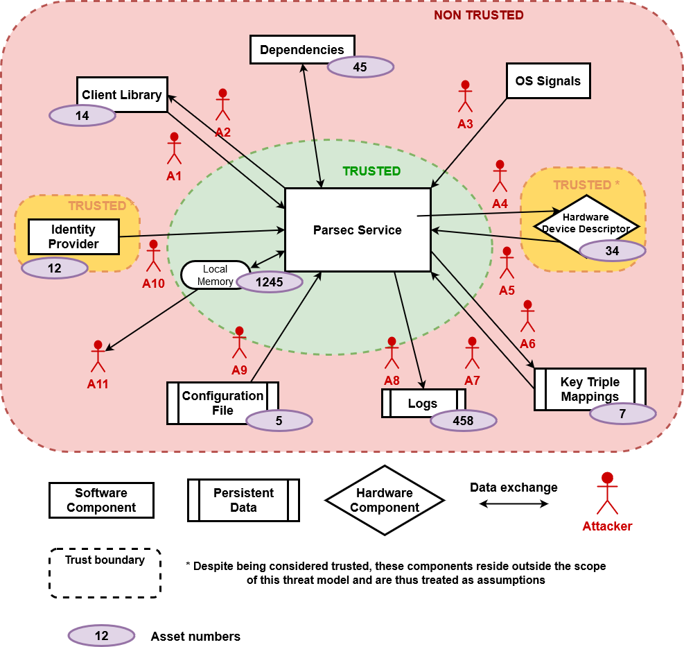

# Parsec Threat Model

This document presents the generic Parsec Threat Model in a multi-tenant environment.

Parsec could also be deployed in an environment where all clients trust each other and there is no
Identity Provider present, and this would lead to some changes to the Threat Model. *These changes
will be written in italic.*

## Dataflow Diagram

## Assumptions

Basic requirements based on which the service can operate securely. Mitigations can be implemented
to make the system more resilient, but if some of these assumptions are not met, the security stance
of the service cannot be guaranteed. For each assumption, the mitigations, operational mitigations
and "unmitigations" that relate to it are mentioned.

1. The hardware modules are physically and functionally secure. Only trusted agents can physically
   access the system.
2. The service is configured and started by a trusted administrator.
3. The OS can be trusted to enforce access-control over critical resources (configuration file, key
   ID mappings, communication socket, etc.) and inter-process communication mechanisms.
4. Users with privilege rights are trusted to exercise them in a non-malicious way.
5. The authentication tokens are stored with confidentiality by the clients. *(N/A)*
6. There is a trusted Identity Provider available. *(N/A)*

## Assets

What we want to protect. Each one of these has a combination of security properties:
Confidentiality, Integrity and Availability. The assets are labelled so that it can be seen in the
threat tables below which ones are impacted by each threat.

### Application Identity - AS1

The Client Library gets its Application Identity from the Identity Provider. It is signed by the
IP's private key and sent by the Client Library on each request. Parsec verifies the Authentication
Token using the IP's public key.

**Confidentiality** : if known (the authentication token), an attacker could impersonate a specific
application and execute operations in their name.

*Not applicable for deployments with no Identity Provider. In a deployment without an Identity
Provider tenants will still have an identity in the form of an application name, but all entities in
the system are trusted not to use identities of other tenants and so confidentiality is not
critical.*

### Identity Provider Public Key- AS2

The IP's public certificate is sent to the service periodically. It is used by the service to verify
the authentication tokens.

**Integrity** : if sent by a malicious IP, attackers could then sign their own application
identities and Parsec will verify them successfully. If they know the Application Identity of
clients, they can impersonate them.

**Availability** : Parsec needs it in order to execute a request.

*Not applicable for deployments with no Identity Provider.*

### Private Keys- AS3

Private keys created by Parsec on behalf of its clients. They should be stored on hardware and never
be extractable.

**Confidentiality, Integrity and Availability** : by nature.

### Client's data- AS4

Data sent by the client as part of a request or data about a client processed by the service. This
could appear in logs.

**Confidentiality** : some of the client's data could be confidential (example: a buffer to
encrypt).

**Integrity** : the data should not be modifiable by attackers. Parsec should be sure that the
source is trusted, and that the client is not being impersonated.

**Availability** : the client should be able to access its stored data in a certain amount of time.

### Configuration data- AS5

Data stored in the configuration file, read at each reloading of Parsec to instantiate components.

**Confidentiality** : the data contains secrets like the user pin of the PKCS 11 device or the owner
hierarchy password of the TPM device.

**Integrity** : the data should only be modified by a trusted Parsec administrator.

**Availability** : the data should be available when loading or re-loading Parsec.

### Availability of the service- AS6

General asset to describe the fact that each client's request should be done in a sane amount of
time. The service should be available at any given point from the moment it is started by the
administrator.

## Attackers

Each dataflow is analysed from an attacker's perspective using STRIDE method. Nothing is supposed on
the different components.

In the following tables are present the type of each possible threat, its description, its
mitigation status and the assets impacted. A threat can be unmitigated (U), mitigated within the
service (M) or mitigated through operational requirements (O). The assumptions context applies for
all threats but when one of them is particularly relevant, it will be noted with A.

*In deployments without an Identity Provider, the A1, A2 and A10 attackers are not considered in
scope, dependent on the O-10 mitigation being deployed.*

### Attacker "Client Request" - A1

This attacker uses the existing Listener endpoint, created by the service, to communicate with it.

*Not applicable for deployments with no Identity Provider.*

|   | Description                                                                                                                                                                   | Mitigation                       | Assets   |
|---|-------------------------------------------------------------------------------------------------------------------------------------------------------------------------------|----------------------------------|----------|
| S | An attacker uses another client's authentication token. He can then have access (reference) to any of the impersonated client's keys and execute any operation in their name. | U-2                              | AS3      |
| S | An attacker uses brute-force on the AUTH field of the request until he does not have an AuthenticationError response status to then deduce a valid authentication token.      | M-2                              | AS1      |
| T | An attacker modifies the valid request of another client to modify the operation and make it non-secure.                                                                      | M-3                              | AS4      |
| R | A client denies the authorship of a request.                                                                                                                                  | M-4                              |          |
| I | An attacker can read the confidential information of a request from another client.                                                                                           | M-3                              | AS1, AS4 |
| I | An attacker steals the authentication token from a client's request to then execute any operation in their name.                                                              | M-3                              | AS4, AS3 |
| D | An attacker modifies the valid request of another client to modify the operation and make it fail.                                                                            | M-3                              | AS6      |
| D | An attacker overloads/crashes the system and thus prevents any other user from making use of the service.                                                                     | Crashes: M-0, M-5 Overloads: U-0 | AS6      |
| E | A malicious request, formatted in a specific way, triggers remote code execution in Parsec privilege level.                                                                   | U-3, M-5                         | All      |
| E | A malicious request exploits a vulnerability in the software stack and leads to an attacker having Parsec privilege level on key management in the underlying hardware.       | U-3, M-5                         | AS3, AS6 |

### Attacker "Service Response" - A2

This attacker uses the existing Listener endpoint, created by the service, to communicate with the
client. It can also create a spoofed endpoint, mimicking the service's one.

*Not applicable for deployments with no Identity Provider.*

|   | Description                                                                                                                                          | Mitigation    | Assets                |
|---|------------------------------------------------------------------------------------------------------------------------------------------------------|---------------|-----------------------|
| S | An attacker impersonates the Parsec service: clients share their data with a malicious entity.                                                       | O-2, O-9      | AS3, AS4, AS6         |
| T | An attacker modifies the response of another client to change its body or its header and thus alter the type, content or status of the response.     | M-3           | AS4                   |
| R | A client denies that the response was indeed sent by the Parsec service.                                                                             | O-2, M-4, O-9 |                       |
| I | An attacker can read the content of a response.                                                                                                      | M-3           | AS4                   |
| I | The response code of a request gives too much information about the way the data is processed by the service that an attacker can use for an attack. | M-1           | Depends on the attack |
| D | An attacker modifies the valid response of another client to pretend it failed or succeeded.                                                         | M-3           | AS6                   |
| D | An attacker modifies the response in such a way that it leads the client to crash.                                                                   | M-3           |                       |
| E | An attacker modifies the response in such a way that it leads to code execution in the client sandbox at the same level as the client.               | M-3           |                       |

### Attacker "OS Signal" - A3

This attacker has the capability of sending signals to the Parsec process. For example, on a Linux
machine a `SIGINT` signal.

|   | Description                                                                                                      | Mitigation | Assets |
|---|------------------------------------------------------------------------------------------------------------------|------------|--------|
| S | N/A                                                                                                              |            |        |
| T | A `SIGHUP` is modified by an attacker into `SIGTERM` or the other way around.                                    | A-3        | AS6    |
| R | N/A                                                                                                              |            |        |
| I | N/A                                                                                                              |            |        |
| D | An attacker can kill the Parsec service, gracefully or not or trigger an infinite loop of configuration reloads. | O-0        | AS6    |
| E | N/A                                                                                                              |            |        |

### Attacker "Service Operation" - A4

This attacker communicates with the security hardware on the platform using the operating system
interfaces.

|   | Description                                                                                                         | Mitigation    | Assets        |
|---|---------------------------------------------------------------------------------------------------------------------|---------------|---------------|
| S | An attacker directly drives the platform hardware to execute commands on it.                                        | O-8           | AS3, AS6      |
| T | An attacker modifies the commands sent to hardware modules.                                                         | O-8, U-3      | AS3, AS6      |
| R | Commands cannot be proven to have originated in the service.                                                        | M-4           |               |
| I | An attacker can read the content of commands to the hardware.                                                       | O-8, U-3      | AS3, AS4, AS5 |
| D | An attacker modifies the commands sent to the hardware to make them fail.                                           | O-8, U-3      | AS6           |
| D | Attacker causes the underlying hardware to fail or be generally unusable.                                           | O-8, U-3, U-1 | AS6           |
| D | Attacker disrupts the software stack that drives the hardware (e.g. replaces or removes PKCS 11 dynamic libraries). | O-8, U-3      | AS6           |
| E | An attacker uses the configured state of a hardware module to make operations with a higher privilege on it.        | O-8, U-3, U-4 | AS3, AS6      |

### Attacker "Hardware Result" - A5

This attacker communicates with the service using the operating system interfaces for hardware. It
can also create a spoofed hardware interface.

|   | Description                                                                                                          | Mitigation    | Assets        |
|---|----------------------------------------------------------------------------------------------------------------------|---------------|---------------|
| S | An attacker impersonates a hardware module or uses a malicious module plugged to the machine.                        | O-1, A-2      | AS4, AS6      |
| T | An attacker modifies the response of a hardware command.                                                             | O-8, U-3      | AS4, AS6      |
| R | Responses cannot be proven to originate from the hardware module.                                                    | M-4           |               |
| I | An attacker can read the content of a command response.                                                              | U-3, O-8      | AS3, AS4, AS5 |
| D | An attacker modifies the valid command response to pretend it failed or succeeded.                                   | U-3, O-8      | AS6           |
| E | A malicious command response, formatted in a specific way, triggers remote code execution in Parsec privilege level. | U-3, M-5, O-8 | All           |

### Attacker "Key Mapping Storage" - A6

Attacker with access to the key ID mapping stream generated by Key ID Managers when storing its data
and to the persistent storage mechanism used for this purpose.

|   | Description                                                                                                                                      | Mitigation | Assets   |
|---|--------------------------------------------------------------------------------------------------------------------------------------------------|------------|----------|
| S | An attacker stores spoofed key handles/material, e.g. allowing themselves to access keys they should not have access to.                         | O-3        | AS3, AS6 |
| T | An attacker modifies the data stored for a mapping to either divert another user to use a different key, or to allow himself access to some key. | O-3        | AS3, AS6 |
| R | The mappings cannot be proven to have been generated by the service.                                                                             | M-4        |          |
| I | Key handles could be leaked and thus used to access keys through other means.                                                                    | O-3        | AS3,AS4  |
| D | An attacker could prevent the storage to be completed, e.g. by filling up the disk and running into space-related issues.                        | O-4        | AS6      |
| E | N/A                                                                                                                                              |            |          |

### Attacker "Key Mapping Retrieval" - A7

Attacker with access to the data stream returning to the Key ID Manager from its source of
persistent storage.

|   | Description                                                                                                                                         | Mitigation    | Assets        |
|---|-----------------------------------------------------------------------------------------------------------------------------------------------------|---------------|---------------|
| S | Attacker spoofs the existence of a mapping and makes the service use an incorrect or invalid key (handle).                                          | M-6, O-3      | AS3, AS4, AS6 |
| T | An attacker alters the retrieval of stored material to change the key that is used for an operation initiated by either himself or some other user. | M-6           | AS3, AS6      |
| R | There is no way to guarantee that the mapping being retrieved was previously stored by the service.                                                 | M-4           |               |
| I | An attacker can read the mapping in transit.                                                                                                        | M-6           | AS3           |
| D | An attacker prevents the value from being read.                                                                                                     | M-6           | AS6           |
| D | An attacker removes all stored values, preventing users from utilizing their keys.                                                                  | O-3           | AS6           |
| D | A malicious key handle, formatted in a specific way, leads to a service crash.                                                                      | O-3, M-5, U-3 | AS6           |
| E | A malicious key handle, formatted in a specific way, triggers remote code execution in Parsec privilege level.                                      | O-3, M-5, U-3 | All           |

### Attacker "Logging" - A8

Attacker with access to the log stream generated by the Parsec service and to the log file.

|   | Description                                                                                                                                  | Mitigation | Assets        |
|---|----------------------------------------------------------------------------------------------------------------------------------------------|------------|---------------|
| S | An attacker could write to the log file, pretending to be the Parsec service and dilute the true logs, potentially hiding errors or crashes. | O-5        | AS6           |
| S | An attacker uses the same logging façade mechanism to write on the logs from a malicious Parsec dependency.                                 | M-7        | AS6           |
| T | Attacker can modify logs to hide/modify details about crashes, errors or any other suspicious activity.                                      | O-5        | AS6           |
| T | An attacker can delete the log file, removing all evidence of previous activity.                                                             | O-5        | AS6           |
| R | There is no guarantee about the true origin of log messages.                                                                                 | O-5        |               |
| I | Log messages can be read by an adversary and their contents can disclose information about the activity of other users.                      | O-5        | AS1, AS4, AS5 |
| D | An attacker prevents access to the logging system by the service putting it in a stall state or triggering errors/crashes.                   | O-5, O-4   | AS6           |
| E | N/A                                                                                                                                          |            |               |

### Attacker "Configuration" - A9

Attacker with access to the configuration file for the Parsec service or to the OS-provided
mechanism for reading it.

|   | Description                                                                                                                   | Mitigation    | Assets   |
|---|-------------------------------------------------------------------------------------------------------------------------------|---------------|----------|
| S | An adversary can spoof a configuration file, leading to the service operating in an ineffective state or not starting at all. | O-6           | AS5, AS6 |
| T | The configuration file set up by the administrator might be modified, leading to the service being ineffective or broken.     | O-6           | AS5, AS6 |
| R | There are no guarantees that the person setting up the configuration file was authorised to do so.                            | O-6           |          |
| I | The configuration file might, if read by an adversary, provide information that opens different attack avenues.               | O-6           | AS5      |
| I | If the configuration file is tampered, information about the existing keys can be extracted through rogue providers.          | O-6           | AS5      |
| D | Removing or altering the configuration file can lead to the Parsec service not starting or working in a broken state.         | O-6           | AS6      |
| E | Parsing a malicious configuration file can lead to code execution at the Parsec privilege level.                              | M-5, U-3, O-6 | All      |

### Attacker "Identity Provider" - A10

Attacker with access to the communication running from the Identity Provider to the Parsec service.

*Not applicable for deployments with no Identity Provider.*

|   | Description                                                                                                                                                                        | Mitigation | Assets           |
|---|------------------------------------------------------------------------------------------------------------------------------------------------------------------------------------|------------|------------------|
| S | The initial trust bundle can be spoofed, and an attacker can thus gain complete control over the service.                                                                          | O-7        | AS2 and then all |
| T | The trust bundle shared by the identity provider can be modified in transit to disrupt the operation of the service or take control of it.                                         | M-3        | AS2 and then all |
| R | The service cannot guarantee that the trust bundle it received comes from the trusted identity provider.                                                                           | O-7        |                  |
| I | N/A - the trust bundle contains public information                                                                                                                                 |            |                  |
| D | If the communication path between identity provider and service is disrupted, the service will not be in a fully functional state as it will not be able to authenticate requests. | M-3        | AS2, AS6         |
| D | A malicious share bundle could trigger a parsing bug and lead the service to crash.                                                                                                | M-5, U-3   | AS2, AS6         |
| E | A malicious share bundle could trigger a parsing bug and lead to code execution at the Parsec privilege level.                                                                     | M-5, U-3   | All              |

## Unmitigations

| ID | Justification                                                                                                                                                                                                                                                                                                                                                                                                                                                                |
|----|------------------------------------------------------------------------------------------------------------------------------------------------------------------------------------------------------------------------------------------------------------------------------------------------------------------------------------------------------------------------------------------------------------------------------------------------------------------------------|
| 0  | An attacker can use all the threads of the service's thread pool, requesting for a time-consuming operation on each one of them, to leave the less amount of free time possible to other clients.                                                                                                                                                                                                                                                                            |
| 1  | Physical Denial of Service attacks are unmitigated.                                                                                                                                                                                                                                                                                                                                                                                                                          |
| 2  | It is assumed that the authentication token is stored with confidentiality by the clients. If it is stolen, the service cannot prevent access with it unless the token is revoked.                                                                                                                                                                                                                                                                                           |
| 3  | Parsec dependencies are not checked for Security Vulnerabilities.                                                                                                                                                                                                                                                                                                                                                                                                            |
| 4  | While Parsec is authenticated on the device, anyone can brute force a key ID to execute operations with the key. Unmitigated for the PKCS 11 Provider: all sessions share the login state; if one session logs in then all other opened sessions will also be logged in. Other sessions only need a valid key ID to execute operations with private keys. Mitigated for the TPM Provider: each key is protected by a long, random authentication value, generated by the TPM |

## Mitigations

| ID | Justification                                                                                                                                                                                                                                                                                                                                                                         |
|----|---------------------------------------------------------------------------------------------------------------------------------------------------------------------------------------------------------------------------------------------------------------------------------------------------------------------------------------------------------------------------------------|
| 0  | Parsec uses a thread pool with a configurable amount of threads to limit the number of concurrent operations it can support so that the machine is not overloaded.                                                                                                                                                                                                                    |
| 1  | Response statuses are audited to not give too much information to the client.                                                                                                                                                                                                                                                                                                         |
| 2  | The authenticators should only allow authentication tokens that are secure enough that brute-force attacks are not feasible.                                                                                                                                                                                                                                                          |
| 3  | Listener implementations use an IPC mechanism respecting confidentiality and integrity of messages transmitted between the clients and the service (once the initial connection has been made). - Unix Domain Socket Listener: the sockets used on the client and service side for the communication are represented by file descriptors that are only accessible by those processes. |
| 4  | The following events are logged by the service with information containing the application identity, time and date: "new request received", "response sent back", "new mapping created", "mapping is read from the persistent store", "a hardware command is issued" and "a hardware command is received".                                                                            |
| 5  | Parsec is coded with safety in mind and is tested extensively (TODO: add a link of test document describing the tests that we do in high-level terms on what platform).                                                                                                                                                                                                               |
| 6  | The `ManageKeyID` implementations communicate with its persistence storage backend through a mechanism respecting confidentiality, integrity and availability. On-Disk Key ID Manager: the mappings are stored on-disk using the filesystem provided by the OS. OS file permissions are used.                                                                                         |
| 7  | Logging is configured to include the software component from where logs are generated.                                                                                                                                                                                                                                                                                                |

## Operational mitigations

| ID   | Justification                                                                                                                                                    |
|------|------------------------------------------------------------------------------------------------------------------------------------------------------------------|
| 0    | A trusted administrator should start the service in such a way that un-privileged processes cannot send signals to the service.                                  |
| 1    | A trusted administrator should check the validity of the providers and hardware modules written in the service's configuration before starting/reloading it.     |
| 2    | Clients need to know from a trusted source that a trusted Parsec service is running on their machine so that they can trust the Listener endpoint.               |
| 3    | Mappings should be put in a location that only the Parsec service and the trusted administrator can access.                                                      |
| 4    | The trusted administrator needs to be notified when any kind of resource is running out.                                                                         |
| 5    | Parsec logs coming from the service binary should be redirected to a file that is only writable by the service and readable by the trusted administrator.        |
| 6    | Parsec configuration file should be only writable by the trusted administrator and readable by the service.                                                      |
| 7    | The trusted administrator needs to check that during the boot process the trusted identity provider has successfully given the root trust bundle to the service. |
| 8    | The hardware descriptors should only be accessible by trusted privileged processes.                                                                              |
| 9    | The Listener endpoint should be put in a location that only the Parsec service and the trusted administrator can access.                                         |
| *10* | *A set of mutually trusted clients has restricted read-write access to the service IPC endpoint.*                                                                |

*Copyright 2020 Contributors to the Parsec project.*
